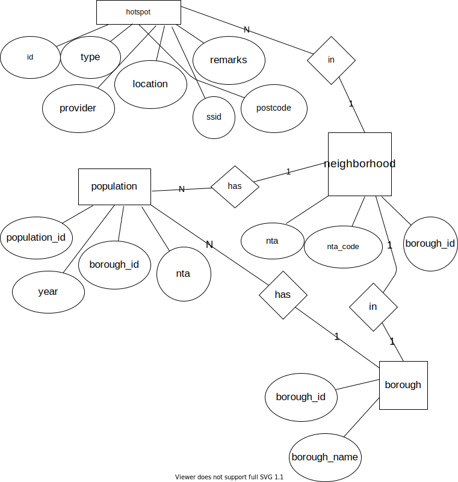

# Exam 1

Update the solution contents of this file according to [the instructions](instructions/instructions.md).

## Solutions

The following sections contain a report on the solutions to each of the required components of this exam.

### Data munging

The code in the Python program, [solution.py](solution.py), contains the solutions to the **data munging** part of this exam.

### Spreadsheet analysis

The spreadsheet file, [wifi.xslx](data/wifi.xslx), contains the solutions to the **spreadsheet analysis** part of this exam. In addition, the formulas used in that spreadsheet are indicated below:

1. Total number of free Wi-Fi hotspots in NYC

```
Place your formula here.
= COUNTIF(C:C, "Free")
```

2. Number of free Wi-Fi hotspots in each of the 5 boroughs of NYC.

```
Place your formulas here - one on each line.
= COUNTIFS(C:C, "Free", R:R, AE7)
= COUNTIFS(C:C, "Free", R:R, AE8)
= COUNTIFS(C:C, "Free", R:R, AE9)
= COUNTIFS(C:C, "Free", R:R, AE10)
= COUNTIFS(C:C, "Free", R:R, AE11)
```

3. Number of free Wi-Fi hotspots provided by the LinkNYC - Citybridge in each of the zip codes of Manhattan.

```
Place your formula for just the zip code 10001 here.
= COUNTIFS(C:C, "Free", D: D, "LinkNYC - Citybridge", V:V, AE25)
```

4. The percent of all hotspots in Manhattan that are provided by LinkNYC - Citybridge.

```
Place your formula here.
= COUNTIFS(D:D, "LinkNYC - Citybridge", R:R, "Manhattan") / COUNTIF(R:R, "Manhattan")
```

### SQL queries

This section shows the SQL queries that you determined solved each of the given problems.

1. Write two SQL commands to create two tables named `hotspots` and `populations`.

```sql
Place your first command here.
create table hotspots
(
    id int,
    borough_id int,
    type text,
    provider text,
    name text,
    location text,
    latitude float,
    longitude float,
    x float,
    y float,
    location_t text,
    remarks text,
    city text,
    ssid int,
    source_id int,
    activated text,
    borocode int,
    borough_name text,
    nta_code int,
    nta int,
    council_district text,
    postcode int,
    boro_cd int,
    census_tract int,
    bctcb2010 int,
    bin int,
    bbl int,
    doitt_id int,
    lat_lng float,
    primary key(id)
);
```

```sql
Place your second command here.
create table populations
(
    borough text,
    year int,
    fips_county_code int,
    nta_code text,
    nta text,
    population int,
    primary key(year, nta_code)
);
```

2. Import the data in the `wifi.csv` and `neighborhood_populations.csv` CSV files into these two tables.

```sql
Place your first command(s) here.
.mode csv
.import data/wifi.csv hotspots
```

```sql
Place your second command(s) here.
.mode csv
.import data/neighborhood_populations.csv populations

```

3. Display the five zip codes with the most Wi-Fi hotspots and the number of Wi-Fi-hotspots in each in descending order of the number of Wi-Fi-hotspots.

```sql
Place your query here.
select postcode, count(postcode) as count
from hotspots 
group by postcode
order by count
desc limit 5;
```

4. Display a list of the name, location, and zip code for all of the free Wi-Fi locations provided by `ALTICEUSA` in Bronx, in descending order of zip code.

```sql
Place your query here.
select name, location, postcode
from hotspots
where type = "Free"
and provider = "ALTICEUSA"
and borough_name = "Bronx"
order by postcode desc; 
```

5. Display the names of each of the boroughs of NYC, and the number of free Wi-Fi hotspots in each.

```sql
Place your query here.
select borough_name, count(id) as count 
from hotspots 
where type = "Free"
group by borough_name;
```

6. Display the number of wifi hotspots in Bay Ridge, Brooklyn along with the population of Bay Ridge, Brooklyn.

```sql
Place your query here.
select count(id), population 
from hotspots
inner join populations
on hotspots.nta_code
= populations.nta_code
where hotspots.nta = "Bay Ridge"
or populations.borough = "Brooklyn"
and populations.year = "2010";
```

7. Display the number of **Free** wifi hotspots in each of the 5 NYC boroughs, along with the population of each borough.

```sql
Place your query here.
select count(id), population
from hotspots
inner join populations
on hotspots.nta_code
= populations.nta_code
where type = "Free"
group by borough_name;
```

8. Display the names of each of the neighborhoods in which there exist Wi-Fi hotspots, but for which we do not have population data.

```sql
Place your query here.
select hotspots.nta 
from hotspots 
left join populations
on hotspots.nta_code = populations.nta_code
where populations.population is null;
```

9. Write an additional SQL query of your choice using MySQL with this table; then describe the results

Write a description of the query here.

```sql
Place your query here.
/* this query prints names of 4 neighborhoods 
that has the least population 
and the number of population in each
in increasing order of the number of population  */
select nta, population
from populations 
order by population asc
limit 4;
```

### Normalization and Entity-relationship diagramming

This section contains responses to the questions on normalization and entity-relationship diagramming.

1. Is the data in `wifi.csv` in fourth normal form?

```
Enter your response here
no, the data in `wifi.csv` is not in fourth normal form
```

2. Explain why or why not the `wifi.csv` data meets 4NF.

```
Enter your response here
data in wifi.csv only satisfies 1NF since all
records in it contain same number of fields.
but it neither satisfies 2NF, 3NF, nor 4NF,
each unqiue id with the same nta_code field has the same nta field.
the nta field nta is a fact about nta_code only,
not a fact about the primary key id.
in wifi.csv, since different boroughs might have the same borough or borough_name, 
borough or borough_name are facts about borough_id only (not present
in the original data), they are not facts about the primary key id 
```

3. Is the data in `neighborhood_populations.csv` in fourth normal form?

```
Enter your response here
no, the data in `neighborhood_populations.csv` is not in fourth normal form
```

4. Explain why or why not the `neighborhood_populations.csv` data meets 4NF.

```
Enter your response here
data in neighborhood_populations.csv only satisfies 1NF
due to the same reasons from question 2.
the nta field nta is a fact about nta_code only,
not a fact about the primary key id.
in neighborhood_populations.csv, since different boroughs 
might have the same borough or borough_name, 
borough or borough_name are facts about borough_id only (not present
in the original data), they are not facts about the primary key id 
```

5. Use [draw.io](https://draw.io) to draw an Entity-Relationship Diagram showing a 4NF-compliant form of this data, including primary key field(s), relationship(s), and cardinality.


