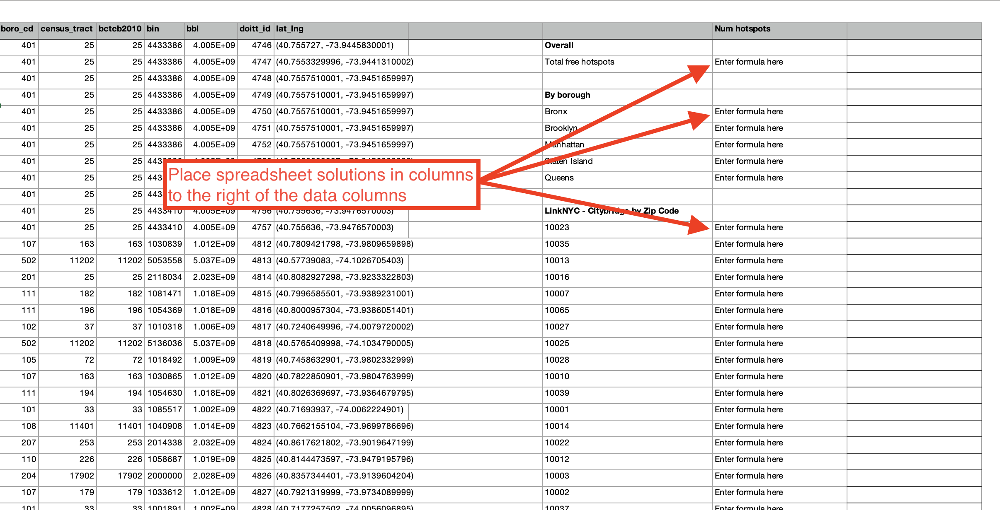

# Exam #1 - Free Wi-Fi in NYC

An exam covering:

- Plain text data formats (CSV, JSON, XML)
- Data munging in Python
- Spreadsheet data analysis
- SQL programming using SQLite databases
- Data normalization
- Entity-relationship diagrams

## Instructions

There two parts to this exam. Please follow the instructions for each:

1. A companion Google Form must be completed and submitted.
1. The instructions below for work to be done within this repository.

## File and directory structure

This repository contains a specific directory/folder structure and specific rules for naming files. Both must be adhered to.

### Directory structure

The purpose of each directory in this repository:

- `data` - must hold all data files. This includes any plain text data files, any spreadsheet files, and any database files.
- `images` - must hold any images file displayed in the documents you will write. Your documents will display these images by using standard Markdown syntax.
- `instructions` - contains instructions for this exam.
- `tests` - contains automated tests that the instructors will use to check basic attributes of your work to make sure it has been done correctly. Do not touch this directory!

### File names

Rules about file names:

- Do not change the names of any existing files.
- The instructions include specific files to create which must be named exactly as indicated.
- Be accurate with capitalization and file extensions.
- File must be placed in the directories indicated. You are not allowed to move any existing files into different directories.

## The data

You are given a data set in the file named [wifi.csv](../data/wifi.csv), which represents all publically available Wi-Fi hotspots in NYC. This data has been extracted and slightly modified from the [NYC Wi-Fi Hotspot Locations data set](https://data.cityofnewyork.us/City-Government/NYC-Wi-Fi-Hotspot-Locations/yjub-udmw), published by NYC Open Data.

You are also given a data set in the file named [neighborhood_populations.csv](../data/neighborhood_populations.csv), which contains the populations of each NYC neighborhood.

### wifi.csv

The data in `wifi.csv` follows the structure indicated in the first few sample lines below, where the first line holds the field headers. See the full data in the file itself.

```csv
id,borough_id,type,provider,name,location,latitude,longitude,x,y,location_t,remarks,city,ssid,source_id,activated,borocode,borough_name,nta_code,nta,council_district,postcode,boro_cd,census_tract,bctcb2010,bin,bbl,doitt_id,lat_lng
9601,4,Free,SpotOnNetworks,QUEENS BRIDGE - JACOB A. RIIS Settlement House,10-25 41 AVENUE,40.755727,-73.9445830001,999603.226171,214613.274563,Indoor AP - Community Center - Computer Rm,Free - Up to 25 mbs Wi-Fi Service,Queens,Quensbridge Connected,NYC HOUSING AUTHORITY,05/01/2018,4,Queens,QN68,Queensbridge-Ravenswood-Long Island City,26,11101,401,25,25,4433386,4004700100,4746,"(40.755727, -73.9445830001)"
9602,4,Free,SpotOnNetworks,QUEENS BRIDGE - JACOB A. RIIS Settlement House,10-43 41 AVENUE,40.7553329996,-73.9441310002,999728.543834,214469.807003,Indoor AP - Queens Public Library,Free - Up to 25 mbs Wi-Fi Service,Queens,Quensbridge Connected,NYC HOUSING AUTHORITY,05/01/2018,4,Queens,QN68,Queensbridge-Ravenswood-Long Island City,26,11101,401,25,25,4433386,4004700100,4747,"(40.7553329996, -73.9441310002)"
9603,4,Free,SpotOnNetworks,QUEENS BRIDGE - JACOB A. RIIS Settlement House,10-05 41 AVENUE,40.7557510001,-73.9451659997,999441.701232,214621.916935,Indoor AP - North Management Office,Free - Up to 25 mbs Wi-Fi Service,Queens,Quensbridge Connected,NYC HOUSING AUTHORITY,05/01/2018,4,Queens,QN68,Queensbridge-Ravenswood-Long Island City,26,11101,401,25,25,4433386,4004700100,4748,"(40.7557510001, -73.9451659997)"
9604,4,Free,SpotOnNetworks,QUEENS BRIDGE - JACOB A. RIIS Settlement House,10-05 41 AVENUE,40.7557510001,-73.9451659997,999441.701232,214621.916935,Indoor AP - North Management Office,Free - Up to 25 mbs Wi-Fi Service,Queens,Quensbridge Connected,NYC HOUSING AUTHORITY,05/01/2018,4,Queens,QN68,Queensbridge-Ravenswood-Long Island City,26,11101,401,25,25,4433386,4004700100,4749,"(40.7557510001, -73.9451659997)"
9605,4,Free,SpotOnNetworks,QUEENS BRIDGE - JACOB A. RIIS Settlement House,10-05 41 AVENUE,40.7557510001,-73.9451659997,999441.701232,214621.916935,Indoor AP - North Maintenance Area,Free - Up to 25 mbs Wi-Fi Service,Queens,Quensbridge Connected,NYC HOUSING AUTHORITY,05/01/2018,4,Queens,QN68,Queensbridge-Ravenswood-Long Island City,26,11101,401,25,25,4433386,4004700100,4750,"(40.7557510001, -73.9451659997)"
```

A few important fields in this data:

- `id` - a unique identifier of each record
- `type` - either `Free` for completely free hotspots, or `Limited Free` for Wi-Fi hotspots with limitations.
- `provider` - the organization providing the Wi-Fi
- `location` - where the hotspot is located
- `remarks` - ad-hoc notes about the hotspot
- `ssid` - the broadcast name that the hotspot shows up as when connecting via Wi-Fi
- `borough_name` - the NYC Borough in which the hotspot is located
- `nta_code` - the code of the neighborhood in which the hotspot is located
- `nta` - the name of the neighborhood in which the hotspot is located
- `postcode` - the zip code of the location of the hotspot

### neighborhood_populations.csv

The data in `neighborhood_populations.csv` follows the structure indicated in the first few sample lines below, where the first line holds the field headers. See the full data in the file itself. This data has been sourced from NYC Open Data's [New York City Population By Neighborhood Tabulation Areas](https://data.cityofnewyork.us/City-Government/New-York-City-Population-By-Neighborhood-Tabulatio/swpk-hqdp/data) data set.

```csv
borough,year,fips_county_code,nta_code,nta,population
Bronx,2000,5,BX01,Claremont-Bathgate,28149
Bronx,2000,5,BX03,Eastchester-Edenwald-Baychester,35422
Bronx,2000,5,BX05,Bedford Park-Fordham North,55329
Bronx,2000,5,BX06,Belmont,25967
Bronx,2000,5,BX07,Bronxdale,34309
```

A few important fields in this data:

- `borough` - the name of the NYC Borough within which this neighborhood is located
- `year` - the year in which the population of this neighborhood was counted
- `nta_code` - the code of the neighborhood, following the same codes as the `nta_code` field in the [wifi.csv](#wifi.csv) data set.
- `nta` - the name of the neighborhood
- `population` - the population of this neighborhood

## Data munging

Write a Python program into the file named [solution.py](../solution.py) to open the `wifi.csv` data file, munge the data according to the instructions below, and save the CSV data to a file named `wifi_clean.csv` within the `data` directory.

### Munging requirements

In the file named `solution.py`, you will find the several function definitions that lack implementations. Complete each of the function definitions according to the comments within the file. At the end, if done correctly, this program will be able to:

1. open the file named [wifi.csv](../data/wifi.csv) within the `data` directory.
1. modify the data in the file, such that...
   - any records with any blank `nta` or `nta_code` fields are removed
   - any records outside of the `latitude` and `longitude` ranges of NYC are removed
   - any records with empty `type` should be defaulted to `Free`.
   - any records with anything other than simply `Free` in the `type` field are removed (i.e. `Limited Free` should be removed)
   - all `location` values are in Title Case.
   - any `provider` with the misspelled name, `SpotOnNetworks`, is corrected to `Spot On Networks`
1. save the modified data to a file named [wifi_clean.csv](../data/wifi_clean.csv), also within the `data` directory.
1. open `wifi_clean.csv` and use the data therein to calculate and output the number of total number of free Wi-Fi hotspots in Fort Greene, Brooklyn.

Rules and regulations:

- You **must** write the code of this Python program according to the instructions written as comments within the program file.
- You **must** use the `csv` module's `DictReader` feature to parse this data.
- You **must** convert the data in this `DictReader` to a regular Python list (in this case the list will contain a Dictionary for every row in the file)
- You **must not** use `pandas` or any other data parsing or analysis module.
- You **must not** modify the original data file - save the changes into the new data file.

## Spreadsheets

In the file named [wifi.xlsx](../data/wifi.xlsx) within the `data` directory, you will find the original data (not the cleaned version) has been imported for you into a spreadsheet file. Complete the tasks below within this file in the designated cells.

**Note**: All major spreadsheet applications can import and export in Microsoft Excel's `.xlsx` file format. You are welcome to use any spreadsheet application of your choice. but your work must be saved in the `wifi.xlsx` file within the `data` directory in Microsoft Excel format with the formulas used to calculate results intact and working.

### Spreadsheet analysis requirements

Perform the following calculations using **singular formulas** within the spreadsheet in the clearly labeled cells given to you **at the top-right of the spreadsheet worksheet**, to the right of all the columns with the raw data in them.



Each formula **must also be entered into the [README.md](../README.md) file** in the designated space.

1. Total number of free Wi-Fi hotspots in NYC
1. Number of free Wi-Fi hotspots in each of the 5 boroughs of NYC. (You are forbidden from hard-coding the names of the boroughs into the formula you use. Rather, the formula should refer to the neighboring cells where the borough names are written.)
1. Number of free Wi-Fi hotspots provided by `LinkNYC - Citybridge` in each of the zip codes of Manhattan. (You are forbidden from hard-coding the zip codes into the formula you use. Rather, the formula should refer to the neighboring cells where the zip codes are written.)
1. The percent of all hotspots in Manhattan that are provided by `LinkNYC - Citybridge`. (You are forbidden from hard-coding any sum or count values into the formula you use. Rather, these should be dynamically calculated within the formula using functions.)

Be sure to save your work.

## SQL

### Setup

You have been given an empty SQLite database named `data.db` within the `data` directory.

### SQL requirements

Write singular SQL commands that perform the following tasks.

Each SQL command **must also be entered into the [README.md](../README.md) file** in the designated space.

1. Write two SQL commands to create two tables named `hotspots` and `populations` within the given database file that can accommodate the data in the `wifi.csv` and `neighborhood_populations.csv` CSV data files, respectively. Use data types and primary key fields that make sense for the data.
1. Import the data in the `wifi.csv` and `neighborhood_populations.csv` CSV files into these two tables. (You may use more than one command to achieve each of these imports, if necessary.)
1. Display the five zip codes with the most Wi-Fi hotspots and the number of Wi-Fi-hotspots in each in descending order of the number of Wi-Fi-hotspots.
1. Display a list of the name, address, and zip code for all of the free Wi-Fi locations provided by `ALTICEUSA` in Bronx, in descending order of zip code.
1. Display the names of each of the boroughs of NYC, and the number of free Wi-Fi hotspots in each.
1. Display the number of wifi hotspots in Bay Ridge, Brooklyn along with the population of Bay Ridge, Brooklyn.
1. Display the number of **Free** wifi hotspots in each of the 5 NYC boroughs, along with the population of each borough.
1. Display the names of each of the neighborhoods in which there exist Wi-Fi hotspots, but for which we do not have population data.
1. Write an additional SQL query of your choice using SQL with this table; then describe the results
   - e.g. "This query identifies all of the Wi-Fi-hotspots in the zip codes where I live and where I go to school and gives me the name and address to find them."

## Data normalization & entity-relationship diagramming

Answer the following questions, and enter your responses into the `README.md` file in the designated spots.

1. Is the data in `wifi.csv` in fourth normal form? Answer based only on those fields described in the [discussion of the data](#the-data) above. Ignore the others.
1. Explain why or why not the `wifi.csv` data meets 4NF.
1. Is the data in `neighborhood_populations.csv` in fourth normal form? Again, answer based only on those fields described in the discussion of the data above. Ignore the others.
1. Explain why or why not the `neighborhood_populations.csv` data meets 4NF.
1. Use [draw.io](https://draw.io) to draw an Entity-Relationship Diagram showing a 4NF-compliant form of this data, including primary key field(s), relationship(s), and cardinality. Again, focus on and diagram only the attributes described in the discussion of data above. Ignore the others. Export the diagram as an `.svg` file into the `images` directory.
